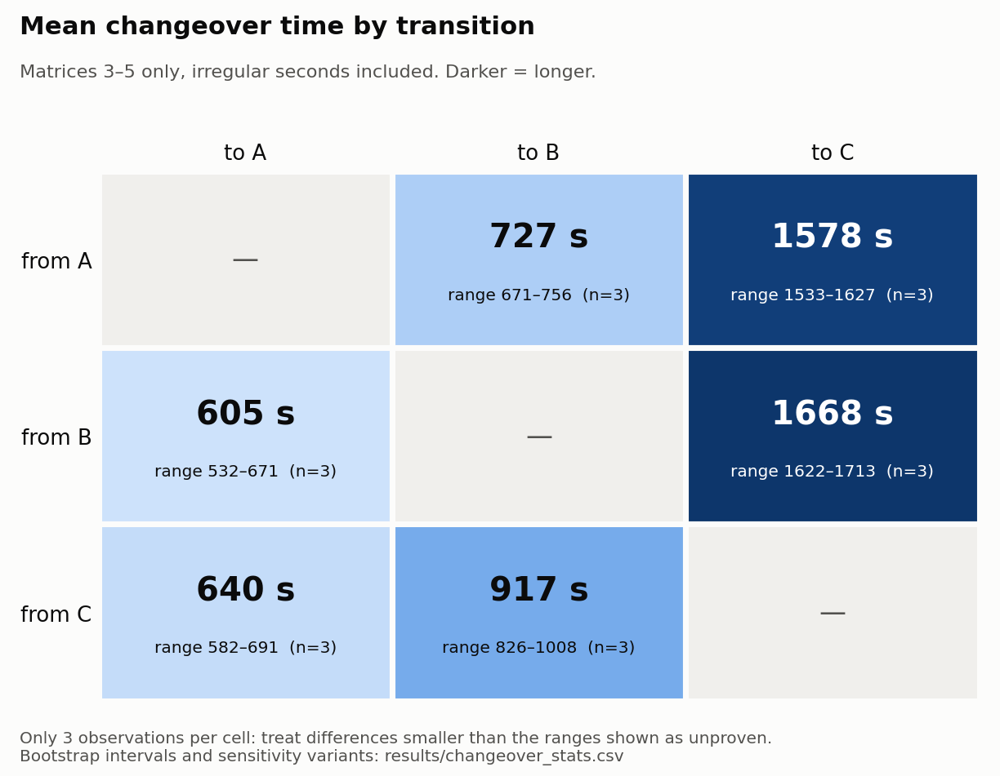
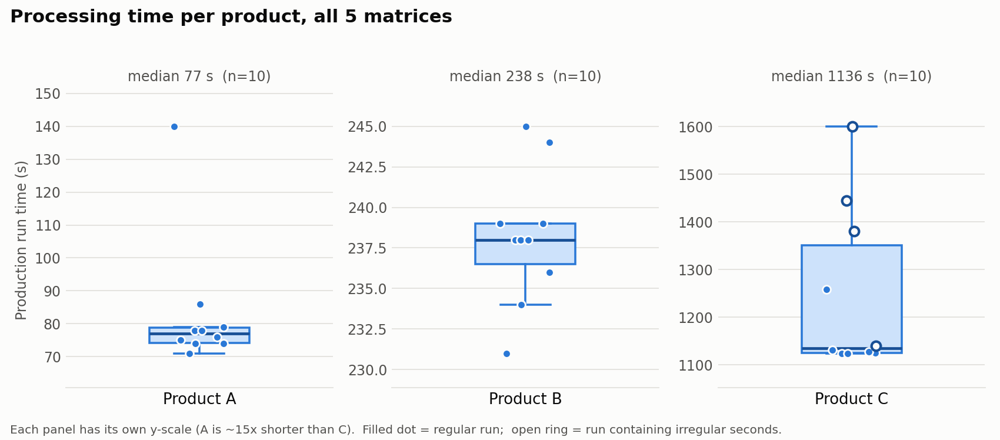
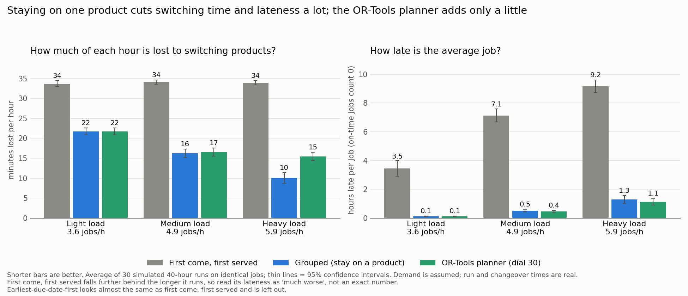
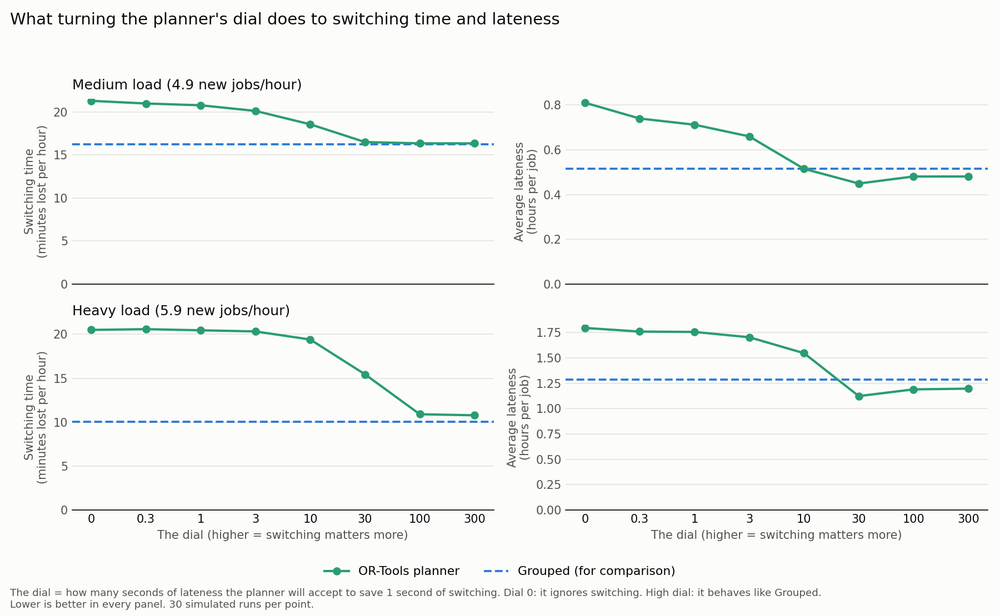
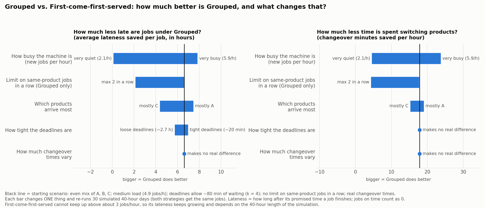
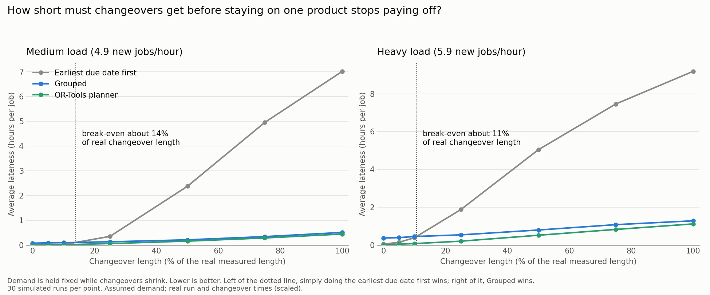
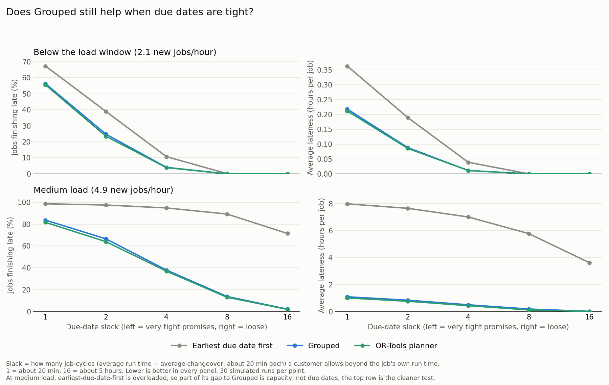
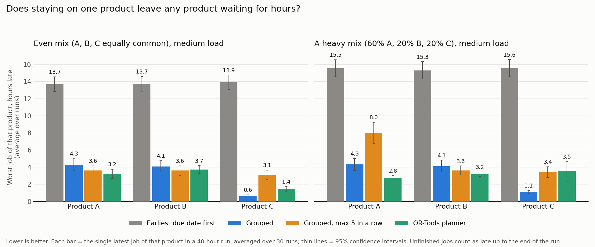

# CNC Production Sequencing: Changeover vs. Lateness Tradeoff

## Summary

On a CNC machine where a product changeover takes 10 to 28 minutes and machining a job takes about 9, running jobs grouped by product cuts the time lost to changeovers from 34 to 16 minutes per hour at medium load, and cuts average lateness from 7.1 hours per job to 0.5.

The simulation uses real run times and changeover times from a public five-axis CNC dataset and assumed customer demand, so it compares scheduling rules but does not describe any real plant. Four ways of choosing the next job are compared: first come first served, earliest due date, Grouped (stay on a product), and an OR-Tools planner that searches for the best order of the waiting jobs.

The main findings:

- Almost all of the benefit comes from grouping, not from optimization. The OR-Tools planner beats Grouped only slightly: about 4 minutes of lateness per job at medium load and about 10 at heavy load.
- Grouping stops paying off only when changeovers shrink to roughly 11% to 14% of their real length, about 1.5 minutes.
- Tight due dates cannot be rescued by any sequencing rule: with 20 minutes of slack, more than half the jobs are late even on a quiet machine.
- Grouping did not leave any product waiting for hours in the cases tested.

## The question

This project asks whether it pays to run jobs in an order that avoids product changeovers, and what that costs in lateness.

A five-axis CNC machine makes three products (A, B, C). Switching from one product to another means a changeover, and in the real data a changeover takes 10 to 28 minutes, while machining one job takes about 9 minutes. If jobs run in the order they arrive, about two of every three jobs need a changeover first. Grouping jobs by product avoids most of them, but an urgent job of another product may have to wait.

The tradeoff is less time switching against finishing jobs by their promised time. The project asks three questions:

1. How much does the order of jobs matter?
2. Does an optimization solver (Google OR-Tools) find better orders than a simple rule?
3. When does grouping stop paying off: for short changeovers, for tight due dates, or for rarely ordered products?

## The data

The run times and changeover times come from a public five-axis CNC dataset (Martinez et al., Scientific Data 2025).

The dataset has 52,026 rows recorded once per second, with 170 machine signals plus ten label columns. The labels say whether the machine is changing over or producing, and which product. From them I rebuilt 60 events: 30 changeovers and 30 production runs. A changeover is one continuous period of switching products. A production run is one continuous period of machining a workpiece. Durations are counted in rows (one row = one second), never by subtracting timestamps, because the recording has gaps.

The dataset has five experimental passes, each making products in the order B, C, B, A, C, A. The first two passes show a learning effect (changeovers get faster with practice), so the changeover averages below use passes 3 to 5 only. That leaves just 3 observations per kind of switch, a small sample.

| Switch | Average changeover | Observations |
| --- | --- | --- |
| B to A | 605 s (10 min) | 3 |
| C to A | 640 s (11 min) | 3 |
| A to B | 727 s (12 min) | 3 |
| C to B | 917 s (15 min) | 3 |
| A to C | 1,578 s (26 min) | 3 |
| B to C | 1,668 s (28 min) | 3 |

Machining one job takes about 522 s (8.7 min) on average for an even mix of products. Per-product run times and the sensitivity checks (all five passes, and with irregular seconds removed) are in `results/processing_stats.csv` and `results/changeover_stats.csv`. The meaning of every label column, and which meanings are confirmed versus inferred, is in `docs/data_dictionary.md`. Download instructions are in `data/README.md`; the data file itself is not stored in this repository.

## Assumptions: what is real and what is assumed

Run times and changeover times are measured from the dataset. Demand is assumed, since the dataset has no order data, so the results hold for the demand patterns tested here.

| # | Input | Value | Real or assumed | Why |
| --- | --- | --- | --- | --- |
| 1 | Run time of a job | Drawn from the 10 observed production runs of that product: A 71 to 140 s, B 231 to 245 s, C 1,124 to 1,601 s | Real | The dataset |
| 2 | Changeover time | Drawn from observed changeovers of that exact switch, passes 3 to 5 (3 per switch) | Real | The dataset; passes 1 and 2 excluded for the learning effect |
| 3 | What a job is | One production run = one workpiece | Assumed | The dataset gives no order sizes |
| 4 | Arrivals | Random (Poisson) at a chosen number of jobs per hour | Assumed | A standard model of independent orders |
| 5 | Load levels | Light, medium, heavy = 15%, 50%, 75% of the way across the range of arrival rates between what an unsorted line can handle (about 3 jobs/h) and what the machine could handle with no changeovers at all (about 6.9 jobs/h); plus a very quiet level at 70% of the lower limit | Assumed | The plan's formula. Heavy load was 85% at first, but that left the machine about 92% busy even with zero changeovers |
| 6 | Product mix | Even (1/3 each); A-heavy, B-heavy, C-heavy (60/20/20) | Assumed | The plan's four mixes |
| 7 | Due date | Arrival + own run time + k job-cycles. A job-cycle = average run time + average changeover an unsorted line pays per job, about 20 min | Assumed | A standard slack-based rule |
| 8 | Slack k | Baseline 4 (about 80 min of waiting allowed); swept from 1 (20 min) to 16 (5.3 h) | Assumed | Chosen so the best rules are neither almost never late nor almost always late. My first scale (k times the average run time, 9 min per unit) left promises shorter than one changeover, so nearly every job was late |
| 9 | Horizon | 40 hours of arrivals; the first 4 hours are discarded as warm-up | Assumed | Long enough for queues to form; the length is a choice |
| 10 | Repeats | 30 per scenario, same jobs for every rule | Assumed | Enough for tight confidence intervals |
| 11 | Starting state | The machine starts with no product set up, so the first job needs no changeover | Assumed | Simplest choice; affects only the first job of each run |

## How the simulation works

The model is a discrete-event simulation of one machine, written with SimPy (`src/simulate.py`). The clock jumps from event to event (a job arrives, a changeover ends, a job finishes) instead of ticking every second, so 40 simulated hours run in a fraction of a second.

One run works like this:

1. **Jobs arrive.** Arrival times are random (a Poisson process, so gaps between jobs vary), at a chosen number of jobs per hour. Each job is one workpiece of product A, B or C, picked according to a product mix.
2. **Each job gets a due date.** Due date = arrival time + its own run time + k job-cycles of slack. One job-cycle is the average run time plus the average changeover an unsorted line pays per job, about 20 minutes.
3. **The machine picks the next waiting job** using one of the four rules in the next section.
4. **If the product differs from the previous job, the machine changes over.** The changeover time is drawn at random from the real observed changeovers for that exact switch.
5. **The machine runs the job** for a run time drawn from the real observed run times of that product, then records when it finished.
6. **After 40 simulated hours** (the first 4 are thrown away as warm-up) the run is scored.

What is scored: minutes per hour lost to changeovers; average lateness per job (lateness = how long after its due date a job finishes, and jobs on time count as 0); the share of jobs that finish late; and the single latest job. Jobs still waiting at the end are not dropped. They count as late up to the end of the run, so unfinished work cannot make a strategy look good.

Every experiment repeats this 30 times with different random jobs. All rules see exactly the same jobs in each repeat (common random numbers), so differences between rules are not just luck of the draw, and results come with 95% confidence intervals.

The simulator is tested in `src/check_simulate.py`: hand-worked cases with known answers, a check that Little's law holds (average jobs in the system = throughput × average time in the system), that no job is lost, and that machine utilization never exceeds 100%.

## Four ways of choosing the next job

Each time the machine is free, a rule picks which waiting job to run next.

| Rule | How it picks | Main weakness |
| --- | --- | --- |
| First come, first served (FCFS) | The job that has waited longest | Ignores product, so about 2 of 3 jobs trigger a changeover |
| Earliest due date (EDD) | The job whose due date is soonest | Also ignores product; the classic rule when switching is free |
| Grouped | Stay on the current product while any of it is waiting (soonest due date within it); switch only when none is left | Can make an urgent job of another product wait |
| OR-Tools planner | Look at the 30 waiting jobs due soonest, find the order with the lowest score, run only its first job, re-plan next time | More complex; its result depends on a dial |

A variant of Grouped puts a cap on how many same-product jobs can run in a row (for example 5).

The planner's score for an order is the total lateness of the jobs it can see plus a dial times the total changeover seconds. The dial is how many seconds of lateness the planner will accept to save one second of changeover. A dial of 0 ignores changeovers and a large dial cares about almost nothing else. Results here use a dial of 30, and the dial sweep is shown with the results.

The planner exists in two versions, both in `src/optimize.py`. The general version is an OR-Tools CP-SAT model: it chooses which job directly follows which, forces one path through all the jobs, and searches for the lowest score. It is exact but too slow to run in every one of hundreds of simulated runs (about 50 seconds per run). So the large experiments use a fast version that keeps jobs of the same product in due-date order and searches the rest exactly. On 60 small random queues the CP-SAT version matched a brute-force try-every-order check every time, and the fast version was on average 0.7% worse than the true best order. In the simulator the two gave the same changeover time and lateness within 2% (3 runs). These checks are in `src/check_optimize.py` and `src/crosscheck_cpsat.py`.

## Results

Staying on one product wins at every load that matters: at medium load Grouped is 0.5 hours late per job against 7.1 hours for first come, first served, and loses 16 minutes of each hour to changeovers instead of 34.

The table compares three rules on an even product mix with k = 4 (about 80 minutes of slack). Each number is the average of 30 simulated 40-hour runs on identical jobs. The planner column uses a dial of 30.

| Load (new jobs/hour) | Switching, min/h: FCFS / Grouped / Planner | Average lateness, hours per job (share of jobs late): FCFS / Grouped / Planner |
| --- | --- | --- |
| Light (3.6) | 34 / 22 / 22 | 3.46 (90%) / 0.12 (16%) / 0.11 (16%) |
| Medium (4.9) | 34 / 16 / 17 | 7.14 (95%) / 0.51 (38%) / 0.45 (37%) |
| Heavy (5.9) | 34 / 10 / 15 | 9.16 (95%) / 1.29 (56%) / 1.12 (51%) |

**Grouping does almost all of the work.** First come, first served cannot keep up above about 3 jobs per hour, so its queue grows for the whole run and its lateness depends on how long you simulate. Read its lateness as "much worse", not as a precise number. At a very quiet 2.1 jobs per hour, where every rule keeps up, the gap is small: 4% of jobs late under Grouped against 15% under first come, first served.

**The OR-Tools planner adds only a little.** Against Grouped it saves about 4 minutes of lateness per job at medium load and about 10 minutes at heavy load, though the heavy-load gap is within the margin of error. At light load there is no clear difference. A low dial hurts: at dial 0 to 3 the planner is worse than Grouped, because it only counts the lateness of jobs it can see and underestimates that every changeover also costs capacity for future jobs. At 30 to 100 it matches or slightly beats Grouped (`results/fig_dial.png`).

**What changes the size of Grouped's advantage** (`results/fig_tornado.png`, one input changed at a time from the medium-load baseline, where Grouped saves 6.6 hours of lateness per job against first come, first served):

- Load matters most: from almost nothing at 2.1 jobs per hour to 7.9 hours at 5.9 jobs per hour.
- Capping same-product runs hurts: a cap of 2 jobs in a row saves only 2.1 hours; a cap of 5 saves 6.1; no cap saves 6.6.
- Product mix matters: 7.5 hours saved when product A dominates, 4.3 hours when the slow product C dominates.
- Due-date tightness matters a little (7.0 hours saved with 20-minute slack, 5.7 hours with 2.7 hours of slack).
- Changeover time variability makes no real difference.

## Where grouping stops helping: three stress tests

Grouping beats simple due-date order unless changeovers are tiny, and it does not leave any product waiting for hours. Tight due dates cannot be rescued by any rule. Each test changes one thing at a time from the baseline.

**1. Break-even changeover length** (`results/fig_breakeven.png`). I shrank every changeover to 0%, 5%, 10%, 25% and so on up to 100% of its real length, kept demand fixed, and compared Grouped with earliest due date first on the same jobs. At 10% of real length, earliest due date first is slightly better (by 283 s of lateness per job, ±71 s, at medium load). At 25%, Grouped is better (by 786 s, ±453 s), and at 100% it is better by 6.5 hours. Drawing a straight line between the points puts the break-even near 14% of real length at medium load and near 11% at heavy load, which is roughly 1.5 minutes per changeover. Real changeovers are 10 to 28 minutes, so on this machine grouping is far above its break-even. Of the three rules in the chart, the planner had the lowest average lateness at every changeover length tested.

**2. Tight due dates** (`results/fig_tight_due.png`). Slack k is the number of job-cycles (about 20 minutes each) a customer allows beyond the job's own run time. The cleanest test is a quiet machine, where every rule keeps up:

| Slack k | Waiting allowed | Jobs late: earliest due date first | Jobs late: Grouped |
| --- | --- | --- | --- |
| 1 | 20 min | 67% | 56% |
| 2 | 40 min | 39% | 25% |
| 4 | 80 min | 11% | 4% |
| 8 | 2.7 h | 0% | 0% |
| 16 | 5.3 h | 0% | 0% |

Grouped's advantage does not disappear with tight promises, but sequencing cannot fix a promise shorter than one changeover: with 20 minutes of slack more than half the jobs are late even on a quiet machine. At medium load, earliest due date first is overloaded and stays 71% to 99% late at every slack, while Grouped goes from 84% late at k = 1 to 2% late at k = 16.

**3. Starvation** (`results/fig_starvation.png`). Grouped might look good on average while one product waits for hours. For each product I measured its single latest job per run, averaged over 30 runs. With an even mix, Grouped's worst job is 4.3 hours late for product A, 4.1 for B and 0.6 for C, against about 14 hours for every product under earliest due date first. With 60% of jobs being A, the figures are 4.3, 4.1 and 1.1 hours. No product is singled out, although the worst job (4.3 hours late) is much later than the average job (0.5 hours late). A cap of 5 same-product jobs in a row made things worse for the common product (8.0 hours for A in the A-heavy mix), because the extra changeovers cost capacity.

## Scope and limits

Run times and changeover times come from a public CNC dataset, and demand is assumed.

- **Demand is modeled.** Arrival rates, product mixes, and due dates are assumptions, because the dataset has no order data.
- **Real inputs come from one machine.** Each changeover has 3 observations and each product 10 run times, so the averages are rough and true variability is likely wider than modeled.
- **One job is one workpiece.** Real orders often come in batches, which would change both run times and the value of grouping.
- **One machine in isolation.** There are no breakdowns, operators, tooling limits, or multi-machine jobs, which keeps the focus on sequencing itself.
- **FCFS and earliest due date cannot keep up** above about 3 jobs per hour, so their queues grow for the whole run and their lateness depends on the 40-hour horizon. The very quiet load is the fairest comparison for them.

## How to reproduce

Everything runs from the repository root with Python 3 and uses fixed random seeds, so the numbers reproduce exactly. Install the packages with `pip install -r requirements.txt`, then follow `data/README.md` to download the dataset into `data/` (it is not stored in the repository).

| Step | Command | What it produces |
| --- | --- | --- |
| Rebuild the 60 events from the raw labels | `python3 src/build_events.py` | `results/events.csv` |
| Check them with an independent method | `python3 src/check_events.py` | pass or fail for all 60 events |
| Run-time and changeover statistics | `python3 src/quantify.py` | `results/processing_stats.csv`, `results/changeover_stats.csv`, two figures |
| Demand scenarios and load levels | `python3 src/scenarios.py` | `results/load_windows.csv`, `results/example_jobs.csv` |
| Test the demand generator | `python3 src/check_scenarios.py` | 8 checks |
| Test the simulator | `python3 src/check_simulate.py` | 12 checks, including hand-worked cases and Little's law |
| Test the sequencing planner | `python3 src/check_optimize.py` | brute-force and hand checks |
| Compare simple rules, one input at a time | `python3 src/screen.py` | `results/screening_*.csv`, `results/fig_tornado.png` |
| Changeover-vs-lateness comparison and dial sweep | `python3 src/tradeoff.py` | `results/tradeoff_results.csv`, `results/fig_tradeoff.png`, `results/fig_dial.png` |
| The three stress tests | `python3 src/stress.py` | `results/stress_*.csv`, `results/fig_breakeven.png`, `results/fig_tight_due.png`, `results/fig_starvation.png` |
| Full OR-Tools model against the fast planner | `python3 src/crosscheck_cpsat.py` | `results/crosscheck_cpsat.csv` (a few minutes) |

The code is organized as follows: `src/scenarios.py` generates jobs, `src/simulate.py` is the SimPy model and the four rules, `src/optimize.py` is the OR-Tools planner, and `docs/` holds the assumptions table and the data dictionary. The simulator and planner are covered by tests that print PASS or FAIL for each check.
